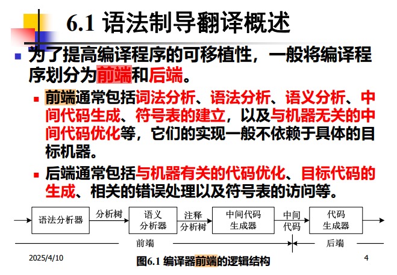
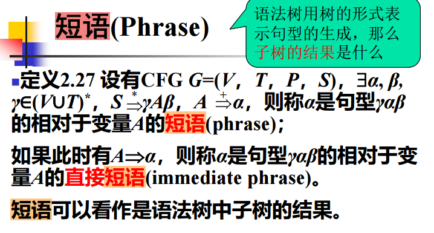
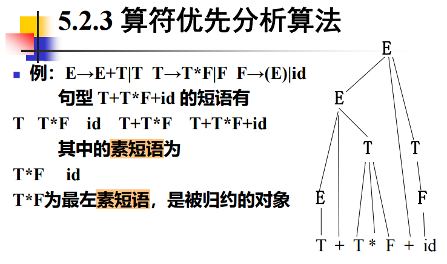

## 编程过程的前端与后端

编程过程可分为**前端**和**后端**，具体描述如下：

### 前端

- 与源语言有关、与目标机无关的部分
- 包括：
    - 词法分析
    - 语法分析
    - 语义分析
    - 中间代码生成
    - 符号表的建立
    - 与机器无关的代码优化

### 后端

- 与目标机有关的部分
- 包括：
    - 与机器有关的代码优化
    - 目标代码生成

---

---

## 短语、直接短语与句柄

**用子树解释短语、直接短语、句柄：**

- **短语**：一棵子树的所有叶子自左至右排列起来形成一个相对于该子树根的短语。
- **直接短语**：仅有父子两代的一棵子树，其所有叶子自左至右排列起来所形成的符号串。
- **句柄**：一个句型的分析树中最左边那棵只有父子两代的子树的所有叶子的自左至右排列。

---

[相关视频讲解（Bilibili）](https://www.bilibili.com/video/BV1af4y1Z7ji/?spm_id_from=333.337.search-card.all.click&vd_source=cd5ee21d66c565fbb87ce2210314b8bb)

---

